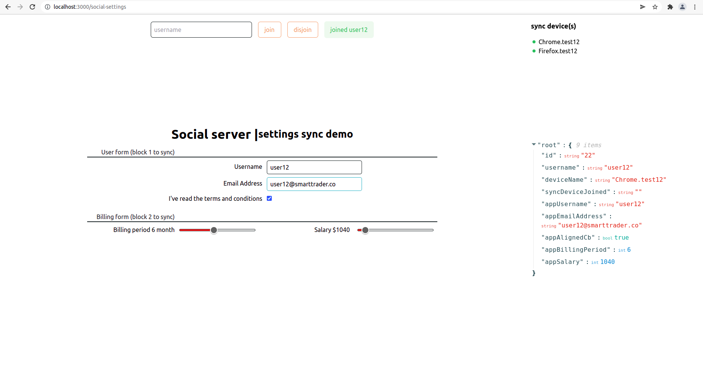
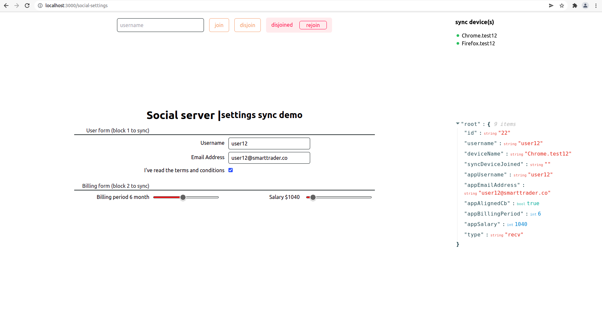
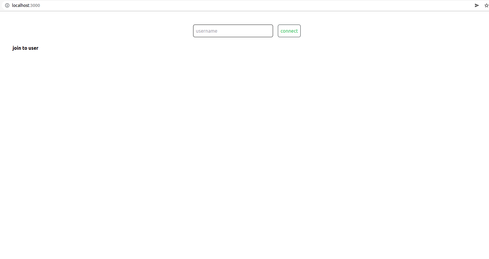
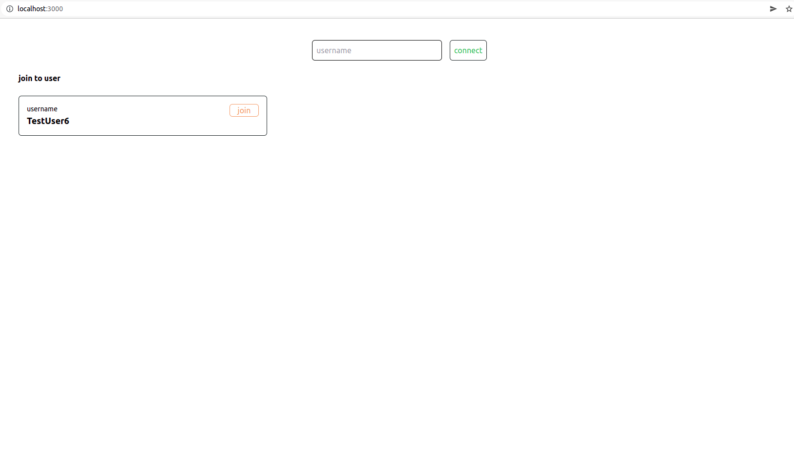
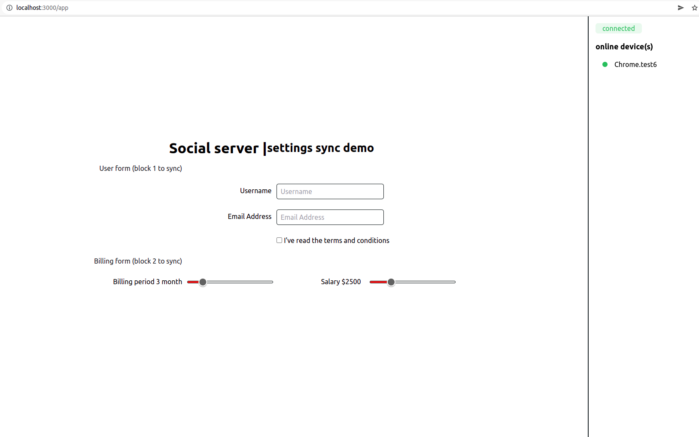
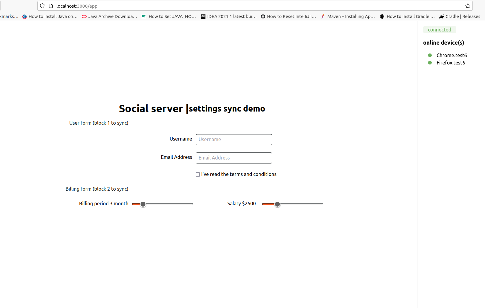
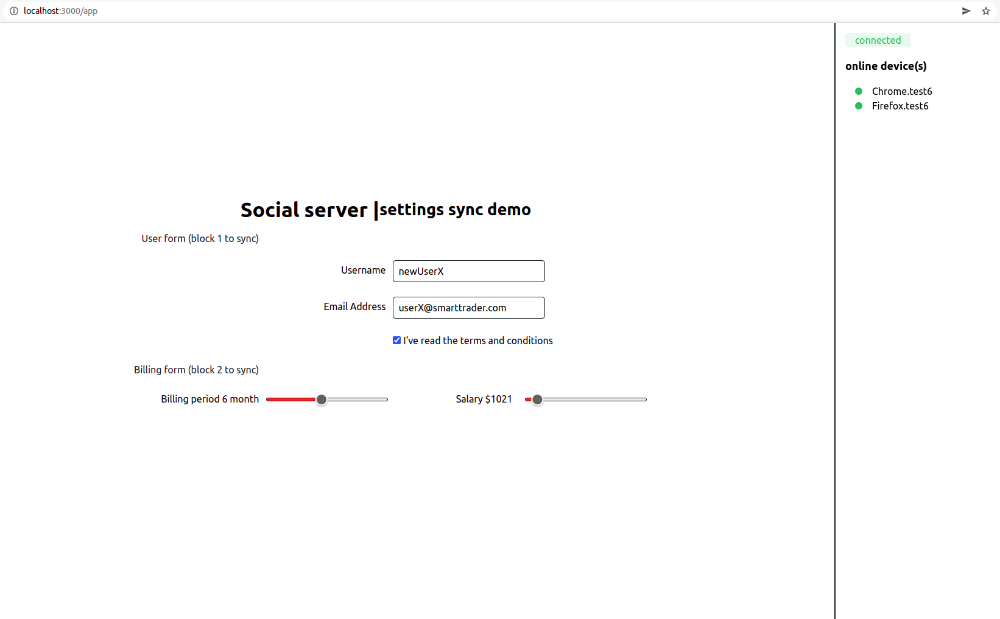
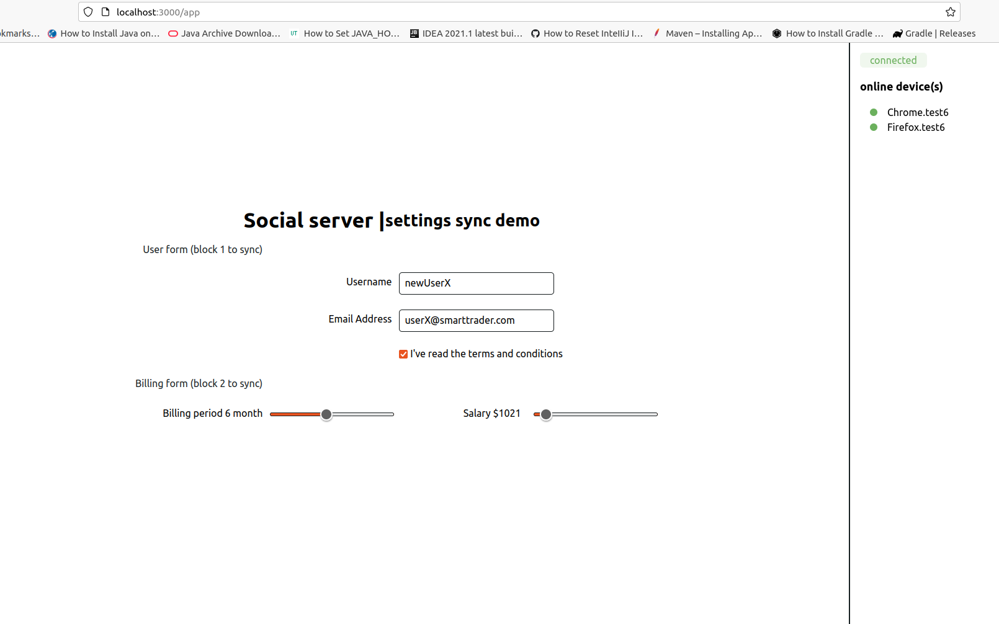

# Social server | settings sync demo

+ Step `Register new Device(s)`: http://localhost:3000/register
  

+ Step `Login use Device`: http://localhost:3000/login
  

+ Step `Connect / Join to one User from several device(s)`: http://localhost:3000
  

  

  

  

* Step `Use Application 'Settings sync demo'`: http://localhost:3000/app
  

  

---

| Folder      | Description |
| ----------- | ----------- |
| server      | Golang API  |
| client      | Next JS     |

+ Language: `Golang`
+ Пакеты:
  - `gorilla / mux` — URL-маршрутизатор и диспетчер, будем использовать этот пакет для сопоставления путей URL с их обработчиками.
  - `jinzhu / gorm` — ORM-библиотека для Golang, будем используем этот пакет, чтобы взаимодействовать с базой данных.
  - `dgrijalva / jwt-go` — используется для подписи и проверки JWT-токенов.
  - `joho / godotenv` — используется для загрузки .env-файлов в проект.

* [Socket.IO — Краткое руководство](https://coderlessons.com/tutorials/kompiuternoe-programmirovanie/uznaite-socket-io/socket-io-kratkoe-rukovodstvo)
  * `Socket.IO` — это библиотека JavaScript для веб-приложений реального времени (RTA). Он обеспечивает двустороннюю связь в реальном времени между веб-клиентами и серверами.
* [Протокол WebSocket — Краткое руководство](https://nodejsdev.ru/doc/websocket)
  * `WebSocket` - это протокол передачи данных, основанный на протоколе TCP обеспечивающий обмен сообщениями между клиентом и сервером в режиме реального времени.
* [Работа с WebSocket и Socket.IO в Go — Учебник](https://tutorialedge.net/golang/golang-websockets-tutorial)
* [Как использовать WebSocket в Golang — Пошаговое руководство](https://yalantis.com/blog/how-to-build-websockets-in-go)

#### WebSockets против SSE — что лучше

* [WebSockets против событий отправленных сервером](https://ably.com/blog/websockets-vs-sse)
* [Резюме Server-Sent Events vs WebSockets](https://stackoverflow.com/questions/5195452/websockets-vs-server-sent-events-eventsource)

`WebSockets` — это тонкий транспортный уровень, построенный поверх стека TCP/IP устройства.
Намерение состоит в том, чтобы предоставить веб-приложениям то, что по сути является уровнем связи TCP, максимально приближенным к сырому...

`SSE` (Server-Sent Events) — **события отправленные сервером** основаны на так называемых событиях DOM, отправленных сервером.
Идея проста: браузер может подписаться на поток событий, генерируемых сервером, и получать обновления всякий раз, когда появляется новая информация...
Соединение остается открытым пока не будет получено указание закрыться путем вызова **EventSource.close()**.

#### WebSockets

Преимущества:
1. WebSockets обеспечивают двустороннюю связь в режиме реального времени.
2. Веб-сокеты обычно не используют XMLHttpRequest, и поэтому заголовки не отправляются каждый раз, когда нам нужно получить дополнительную информацию с сервера. Это, в свою очередь, снижает нагрузку на дорогостоящие данные, отправляемые на сервер.
3. Соединения WebSocket могут как отправлять, так и получать данные из браузера. Приложение для чата — хороший пример базового приложения, которое может использовать WebSockets.
4. WebSockets может передавать как бинарные данные, так и UTF-8

Недостатки:
1. Когда соединения прерываются, веб-сокеты не восстанавливаются автоматически — это то, что вам нужно реализовать самостоятельно, и это одна из причин, по которой существует множество клиентских библиотек .
2. Обратите внимание, что браузеры старше 2011 года не поддерживают соединения WebSocket.
3. Некоторые корпоративные брандмауэры с проверкой пакетов имеют проблемы с WebSockets (особенно SophosXG Firewall, WatchGuard, McAfee Web Gateway).

Преимущества WebSockets перед SSE:
+ В режиме реального времени, двухсторонняя связь.
+ Встроенная поддержка в большем количестве браузеров

#### SSE

Преимущества:
1. Передается по простому HTTP вместо пользовательского протокола
2. Может быть заполнен javascript для «бэкпорта» SSE в браузеры, которые его еще не поддерживают.
3. Встроенная поддержка повторного подключения и идентификатора события
4. Нет проблем с корпоративными брандмауэрами, выполняющими проверку пакетов
5. Полезно для приложений, которые обеспечивают одностороннюю передачу данных, например цены на акции в реальном времени.

Недостатки:
1. SSE ограничен UTF-8 и не поддерживает двоичные данные.
2. SSE имеет ограничение на максимальное количество открытых подключений. Это может быть особенно болезненно при открытии различных вкладок, так как ограничение для каждого браузера установлено на очень низкое число (6).
3. SSE является однонаправленным

Преимущества SSE перед Websockets:
+ Передается по простому HTTP вместо пользовательского протокола
+ Может быть заполнен javascript для «бэкпорта» SSE в браузеры, которые его еще не поддерживают.
+ Встроенная поддержка повторного подключения и идентификатора события
+ Более простой протокол
+ Нет проблем с корпоративными брандмауэрами, выполняющими проверку пакетов

---

+ [Пример приложения чата](https://github.com/kyopark2014/webchat-golang-socketio)
  - В котором socket.io используется для соединения сервера и клиента;
  - В этом проекте была развернута структура PUBSUB для поддержки Say, Join and Leave;
  - Оно поддерживает 1-to-1 и групповой чат с использованием канала связи;
+ [Пример приложения чата при поддержке Redis](https://levelup.gitconnected.com/building-chat-service-in-golang-and-websockets-backed-by-redis-b42a8784636c)
  - socket.io используется для соединения сервера и клиента;
  - развернута структура PUBSUB для поддержки Say, Join and Leave;
  - поддержка Redis и Redis-Persistence;
+ [Примеры Node.js Websocket с Socket.io](https://rukovodstvo.net/posts/id_1357)
